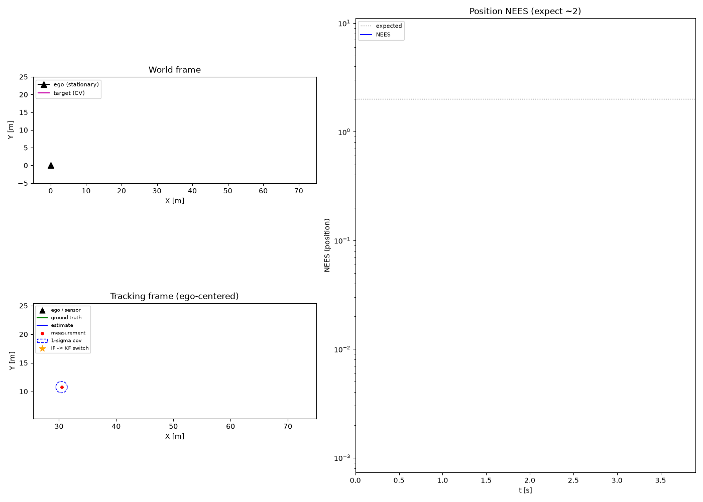
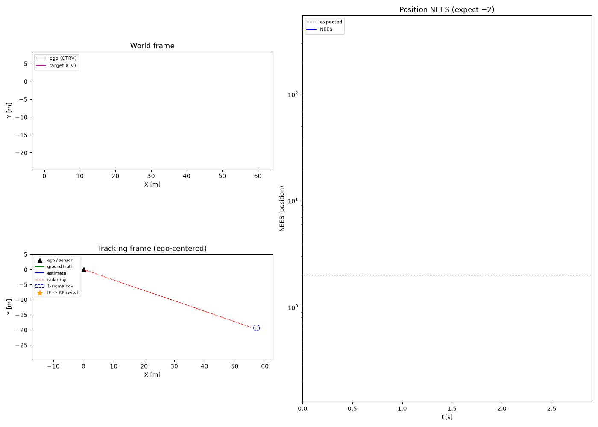
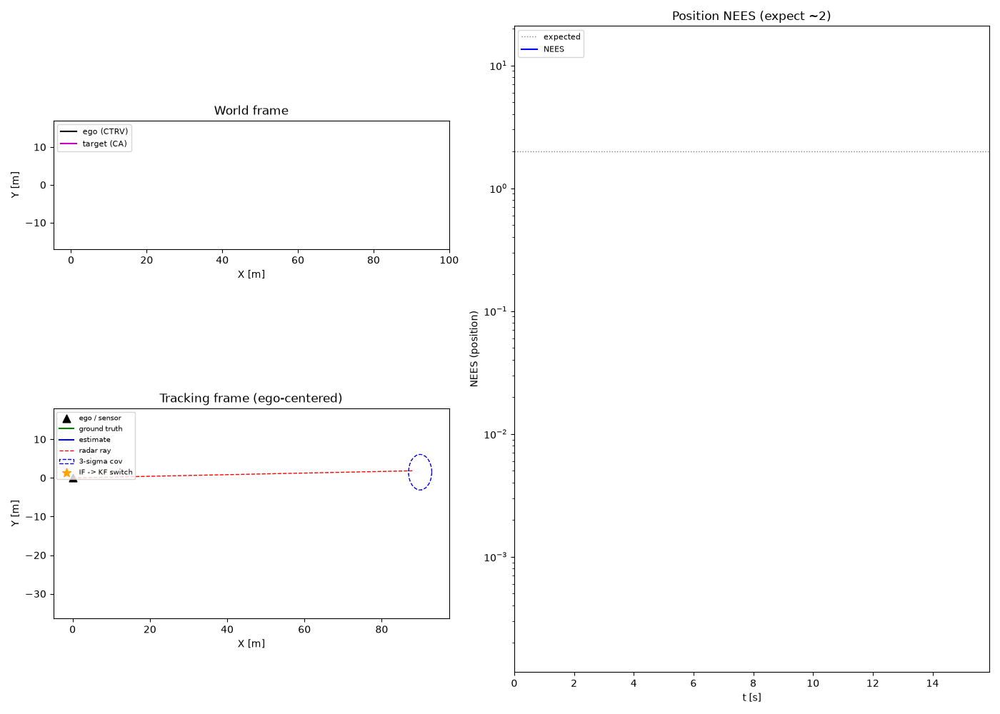

# Tracking Library

[](https://www.gnu.org/licenses/gpl-3.0)
[](https://en.wikipedia.org/wiki/C%2B%2B17)
[](https://cmake.org/)
[](https://gcc.gnu.org/)
[](https://clang.llvm.org/)
[](https://clang.llvm.org/docs/ClangFormat.html)
[](https://clang.llvm.org/extra/clang-tidy/)
[](https://google.github.io/googletest/)
[](https://www.doxygen.nl/)
[](https://github.com/linux-test-project/lcov)

## About

[](https://github.com/mserfli/trackinglib/actions/workflows/build-and-test.yml)
[](https://mserfli.github.io/trackinglib/coverage/)
[](https://mserfli.github.io/trackinglib/docs/)

Academic C++ header-only library for object tracking using Kalman filter variants.

The [architecture overview](doc/info_architecture.md) shows a class diagram of the core tracking classes and their relationships.

The state and covariance prediction flow depending on the used filter (Kalman, Informationfilter) and used covariance representation (full, factored) is documented in the [prediction sequence diagram](doc/info_filter_prediction.md).

The measurement update flow — how the observation models are evaluated and how the update differs between the filters and covariance representations — is documented in the [update sequence diagram](doc/info_filter_update.md).


## Key Concepts

**Library Design**: Header-only C++ library for academic object tracking using Extended Kalman Filter (EKF) and Information Filter (IF) variants on the available motion models. All motion models can be configured to use a factored or normal covariance matrix and have a predictor with built-in support for the ego motion compensation. Measurement updates are driven by interchangeable observation models (position, velocity, range-bearing, range-bearing-doppler) that can be composed into a single joint update, with the block or sequential update algorithm selected at compile time to match the covariance representation.

The factored implementations are mainly based on publications from D'Souza, Bierman, Thornton, Carlson (see References).

### Code Example: Interchangeable Filters and Covariance Types

The library's advanced architecture allows seamless interchangeability between Kalman and Information filters, as well as between full and factored covariance matrices during prediction. Below is a minimal example demonstrating this flexibility:

```cpp
#include "trackingLib/motion/motion_model_cv.hpp"
#include "trackingLib/filter/kalman_filter.hpp"
#include "trackingLib/filter/information_filter.hpp"

using namespace tracking;

// CV motion models with different covariance types
using MMCV_Full     = motion::MotionModelCV<math::FullCovarianceMatrixPolicy<float64>>;
using MMCV_Factored = motion::MotionModelCV<math::FactoredCovarianceMatrixPolicy<float64>>;

// Corresponding filter types supported by the motion model
using KalmanFilter         = MMCV_Full::KalmanFilterType;
// using InformationFilter = MMCV_Full::InformationFilterType;

// using KalmanFilter   = MMCV_Factored::KalmanFilterType;
using InformationFilter = MMCV_Factored::InformationFilterType;

// Create filter instances
KalmanFilter      kalmanFilter{};
InformationFilter informationFilter{};

// Corresponding ego motion types (stationary for simplicity)
auto egoMotion_full     = MMCV_Full::EgoMotionType{/* parameters */};
auto egoMotion_factored = MMCV_Factored::EgoMotionType{/* parameters */};

// Initialize motion models with initial state and covariance
auto mm_full = MMCV_Full::FromLists({/* State ... */}, {/* Covariance ... */ });
auto mm_factored = MMCV_Factored::FromLists({/* State ... */}, {/* Covariance ..., will be factored */ });

// Perform predictions with different filter-covariance combinations
mm_full.predict(0.1, kalmanFilter, egoMotion_full);       // Kalman + Full Covariance
mm_factored.predict(0.1, informationFilter, egoMotion_factored); // Information + Factored Covariance
```

This example highlights the template-based design enabling compile-time selection of filter types and covariance representations, ensuring optimal performance and numerical stability.

### Code Example: Measurement Update with Observation Models

Correcting a motion model with a measurement mirrors the prediction path: an observation model
carries the measurement `z` and its covariance `R`, and `update()` applies the (extended) Kalman or
information-form update in place. Each observation model describes *one* measured quantity — e.g.
position (`X, Y`) and velocity (`VX, VY`) are separate models. A single observation model performs a
plain update; passing multiple models composes them into one joint (stacked) update. The update
algorithm (block vs. sequential) defaults to the covariance policy and can be overridden at the call
site.

When a single measurement device delivers several quantities at the same time step (e.g. a sensor
reporting both position and velocity), list all of its observation models in **one** `update()`
call. They are then stacked into a single joint update (`H`, `z` and the block-diagonal `R` are
composed together) — this is the correct way to fuse simultaneous measurements, not two consecutive
`update()` calls.

```cpp
#include "trackingLib/motion/motion_model_cv.hpp"
#include "trackingLib/filter/kalman_filter.hpp"
#include "trackingLib/observation/position_observation_model.h"
#include "trackingLib/observation/velocity_observation_model.h"

using namespace tracking;

using Policy = math::FullCovarianceMatrixPolicy<float64>;
using MM     = motion::MotionModelCV<Policy>;

// Observation models observing the CV state definition
using PositionObs = observation::PositionObservationModel<Policy, motion::StateDefCV>;
using VelocityObs = observation::VelocityObservationModel<Policy, motion::StateDefCV>;

MM::KalmanFilterType kalmanFilter{};
auto motionModel = MM::FromLists({/* State ... */}, {/* Covariance ... */});

// Measurement vector z and covariance R per observation model
auto posObs = PositionObs::FromLists({/* x, y */},     {/* R ... */});
auto velObs = VelocityObs::FromLists({/* vx, vy */},   {/* R ... */});

// Single-model update (block for full, sequential for factored — chosen automatically)
motionModel.update(kalmanFilter, posObs);

// One device measuring BOTH position and velocity at this time step: list both models in a
// single call so they are fused as one joint (stacked) update — NOT two consecutive update() calls
motionModel.update(kalmanFilter, posObs, velObs);
```

For the Information filter the same call operates in information space; the observation models are
evaluated on the state mean internally and the update accumulates information additively
(`Y += H'*inv(R)*H`). See the [update sequence diagram](doc/info_filter_update.md) for the full
flow and the [single object tracking example](examples/single_linear_object_tracking.cpp) for a
runnable scenario combining prediction and updates.


**Core Components**:
- **Motion Models**: Constant Velocity (CV) and Constant Acceleration (CA) with ego motion compensation
- **Observation Models**: Position, Velocity, Range-Bearing and Range-Bearing-Doppler, composable into a single joint measurement update
- **Matrix Library**: Self-contained linear algebra library with UDU factored covariance matrices for enhanced numerical stability, ensuring positive semi-definiteness by design
- **Filter Variants**: EKF and IF with both full and factored covariance support, with block and sequential measurement update modes

**Key Requirements**:
- **Standards**: C++17 minimum, AUTOSAR C++14 compliant
- **Safety**: No exceptions (tl::expected pattern), no dynamic allocation in core algorithms
- **Quality**: Zero compile warnings, Comprehensive unit tests, >90% line coverage target, comprehensive Doxygen documentation

**Design Patterns**:
- **Template-Based**: Compile-time type safety and dimension checking
- **CRTP Interfaces**: Curiously Recurring Template Pattern for static polymorphism
- **Policy-Based Design**: Covariance matrix policies (Full/Factored) for flexible implementations
- **Centralized Conversions**: `<target>From<source>` naming for type conversions
- **Factory Methods**: Convenient initialization via `FromLists()` methods

**Modern C++ Features**:
- **C++20 Concepts**: Used for strict API contracts without inheritance, enabling compile-time interface checking
- **Contract Classes**: Custom contract system with `RequireCopyIntf`, `RequireMoveIntf` for compile-time enforcement of class capabilities
- **Template Metaprogramming**: Extensive use of templates for type safety and zero-runtime-overhead abstractions

**Tools & Technologies**:
- **Build**: CMake 3.24+, GCC/Clang compilers
- **Testing**: GoogleTest framework, lcov coverage
- **Quality**: clang-format, clang-tidy, Doxygen
- **Error Handling**: tl::expected (Rust-style Result pattern)


## Visualized Examples

Both `examples/*.cpp` can optionally export a per-step CSV alongside their console output, rendered
into an animated GIF by `examples/viz/render.py` (ground truth, noisy measurements, the filter's
estimated track, and a 1-sigma covariance ellipse). See [examples/viz/README.md](examples/viz/README.md)
for how to regenerate these.

**Single linear object tracking** ([source](examples/single_linear_object_tracking.cpp)) — a
stationary sensor tracking a constant-velocity object via direct (x, y) position measurements,
bootstrapped by the InformationFilter and handed over to the KalmanFilter:



**Single nonlinear object tracking** ([source](examples/single_nonlinear_object_tracking.cpp)) — a
moving ego vehicle (CTRV arc) tracking a crossing object via a front-mounted radar's noisy
range/bearing/doppler measurements, EKF-linearized at each step:



**Single nonlinear figure-8 object tracking** ([source](examples/single_nonlinear_figure8_object_tracking.cpp)) — a
slow-moving ego vehicle (CTRV arc) tracking a target driving a figure-8 (Lemniscate of Gerono) via
the same radar model; the target's repeatedly reversing curvature is a harder process-model
mismatch for the constant-velocity motion model than the crossing-object scenario above:



## Planned Features

### Non-linear Motion Models (CTRV/CTRA)
Future plans include extending the currently linear Motion Models with non-linear models like CTRV and CTRA.

### Unscented Kalman Filter (UKF)
Future plans include adding support for Unscented Kalman Filters, alongside the existing EKF and Information Filter.

### Interacting Multiple Model (IMM) filtering
Future plans include an IMM wrapper to blend multiple motion models (e.g. straight-line and turning) for objects that switch between driving behaviors.

### Examples using the library based on 3D simulation frameworks
Future plans include the usage of the library in one of the famous 3D simulation robotics/autononmous driving frameworks

## Building

### Prerequisites

- CMake 3.24 or higher
- C++17 compatible compiler (GCC 7+, Clang 5+, MSVC 2017+)
- For documentation: Doxygen and Graphviz
- For coverage reports (Linux): lcov

### Quick Start

```bash
# Create build directory
mkdir build && cd build

# Configure with CMake (default: Debug build, C++17)
cmake ..

# Build the library and examples
cmake --build .

# Run tests
ctest --output-on-failure

# Build examples (optional, enabled by default)
cmake --build . --target single_linear_object_tracking single_nonlinear_object_tracking
./single_linear_object_tracking
```

### Build Options

- **Build Type**: Set with `-DCMAKE_BUILD_TYPE=Release` for optimized builds
- **C++ Standard**: Set with `-DCMAKE_CXX_STANDARD=20` for C++20 features
- **Examples**: Disable with `-DBUILD_EXAMPLES=OFF`
- **Tests**: Enable with `-DBUILD_TESTING=ON`
- **Header Tests**: Enable with `-DBUILD_HEADER_TESTS=ON`

### Documentation

```bash
# Generate Doxygen documentation
doxygen
# Open html/index.html in your browser
```

### Coverage Report (Linux only)

```bash
# Generate coverage report
./coverage_report.sh
# Open build_cov/coverage/index.html in your browser
```

## References

* C. D'Souza and R. Zanetti, "Information Formulation of the UDU Kalman Filter," in IEEE Transactions on Aerospace and Electronic Systems, vol. 55, no. 1, pp. 493-498, Feb. 2019, doi: 10.1109/TAES.2018.2850379.
* Pourtakdoust, Seid H. "Ud Covariance Factorization For Unscented Kalman Filter Using Sequential Measurements Update," 2007, doi:10.5281/ZENODO.1071229.
* Gerald J. Bierman, "Factorization Methods for Discrete Sequential Estimation", 1977
* Catherine L. Thornton, "Triangular Covariance Factorizations for Kalman Filtering", 1976
* Philip E. Gill, "Practical optimization", 2019, doi.org/10.1137/1.9781611975604

## License

This project is licensed under the GNU General Public License v3.0 - see the [LICENSE](LICENSE) file for details.
