# Measurement Update Flow for Kalman and Information Filter

## Overview

This document shows the complete measurement-update flow for both Kalman Filter and Information
Filter, highlighting how the observation models are evaluated and how the update differs between
the state-space and information-space representations as well as between the full and factored
covariance handling. It mirrors the [prediction flow](info_filter_prediction.md).

The update is driven by one or more **observation models**. A single observation model performs a
plain measurement update; multiple models are *composed* into one joint update by stacking their
innovations, Jacobians and (block-diagonal) covariances (`TotalDimZ` = sum of all model
dimensions). The update mode is selected at compile time (see `filter::update_mode`):

- **Block**: one `TotalDimZ`-sized update (full covariance policy only).
- **Sequential**: scalar row-by-row updates (required for the factored policy, keeps the UDU
  factorization intact); a correlated `R` is decorrelated first via `R = U*D*U'`.

The default is chosen per covariance policy: `Block` for full, `Sequential` for factored.

## Update Flow Diagram

```mermaid
sequenceDiagram
    participant User
    participant MM as MotionModelCV
    participant GU as GenericUpdate::run
    participant OM as ObservationModels
    participant KF as KalmanFilter
    participant IF as InformationFilter

    User->>MM: update(filter, observationModels...)
    MM->>GU: run [UpdateMode] (filter, motionModel, observationModels...)

    rect rgb(40,40,40)
        Note over GU:  State Space Transformation
        alt InformationFilter
            GU->>MM: convertStateVecIntoStateSpace()
            Note right of MM: x = Y^-1 * y<br/>Evaluate the observation<br/>models in state space
        end
    end

    rect rgb(40,40,40)
        Note over GU,OM:  Observation Stacking Phase
        loop for each observation model
            GU->>OM: computeJacobian(Hi, x)
            OM-->>GU: Hi block -> H
            GU->>OM: predictMeasurement(x)
            OM-->>GU: h(x)
            GU->>OM: computeInnovation(z, h(x))
            Note right of OM: nu = z - h(x)<br/>(bearing/doppler models<br/>wrap the angle)
            OM-->>GU: nu block -> innovation
            GU->>OM: getCov()
            OM-->>GU: Ri block -> R (block-diagonal)
        end
    end

    rect rgb(40,40,40)
        Note over GU:  Effective Measurement (Information only)
        alt InformationFilter
            GU->>GU: z_eff = nu + H*x
            Note right of GU: linearized measurement,<br/>equals z for linear models
            GU->>MM: convertStateVecIntoInformationSpace()
            Note right of MM: y = Y * x with the PRIOR Y
        end
    end

    rect rgb(40,40,40)
        Note over GU,IF:  Measurement Update Phase
        alt KalmanFilter with Full Covariance (Block)
            GU->>KF: updateState [Block] (x, P, nu, H, R)
            Note right of KF: S = H*P*H' + R<br/>K = P*H'*inv(S)<br/>x += K*nu<br/>P = (I-K*H)*P*(I-K*H)' + K*R*K'<br/>(Joseph stabilized)
            KF-->>GU: x, P updated
        else KalmanFilter with Factored Covariance (Sequential)
            GU->>GU: factor stacked R = U*D*U'
            GU->>KF: updateState [Sequential] (x, P, nu, H, R)
            Note right of KF: decorrelate (nu,H) by inv(U)<br/>per row i:  v = P*h_i'<br/>s = h_i*v + d_ii<br/>x += v*nu_i/s<br/>P -= v*v'/s<br/>(Agee-Turner keeps UDU intact)
            KF-->>GU: x, P updated
        else InformationFilter with Full Covariance (Block)
            GU->>IF: updateState [Block] (y, Y, z_eff, H, R)
            Note right of IF: purely additive information update<br/>y += H'*inv(R)*z_eff<br/>Y += H'*inv(R)*H
            IF-->>GU: y, Y updated
        else InformationFilter with Factored Covariance (Sequential)
            GU->>GU: factor stacked R = U*D*U'
            GU->>IF: updateState [Sequential] (y, Y, z_eff, H, R)
            Note right of IF: decorrelate (z_eff,H) by inv(U)<br/>per row i (c = 1/d_ii):<br/>Y += c*h_i*h_i'<br/>y += c*z_i*h_i
            IF-->>GU: y, Y updated
        end
    end

    GU-->>MM: Update complete
    MM-->>User: Kalman: x, P<br/>Information: y, Y
```



## Key Differences Between Filters

| Aspect | Kalman Filter | Information Filter |
|--------|---------------|-------------------|
| **State Vector** | x (state) | y = Y * x (information vector) |
| **Covariance** | P (covariance) | Y = P^-1 (information matrix) |
| **Pre-Processing** | None | `convertStateVecIntoStateSpace()` |
| **Measurement** | innovation nu = z - h(x) | effective z_eff = nu + H*x |
| **Post-Processing** | None | `convertStateVecIntoInformationSpace()` (prior Y) |
| **Update** | Gain-based (Kalman gain K) | Additive (Y += H'*inv(R)*H) |

## State Representation

### Kalman Filter
- State vector: `x` in state space
- Covariance: `P` (covariance matrix)
- Observation models are evaluated directly on `x`; no transformation needed

### Information Filter
- State vector: `y = Y * x` (information vector)
- Covariance: `Y = P^-1` (information matrix)
- Requires transforming into state space to evaluate the observation models and back into
  information space (using the prior `Y`) before applying the additive update

## Observation Models

Concrete observation models derive from `ExtendedObservationModel` (CRTP) and provide two
statically dispatched hooks — `predictMeasurement()` (`h(x)`) and `computeJacobian()`
(`H = dh/dx`) — plus an optional shadowed `computeInnovation()` for components that need special
innovation handling (e.g. angle wrapping). The models shipped with the library are:

| Model | DimZ | Measurement h(x) | Notes |
|-------|------|------------------|-------|
| `PositionObservationModel` | 2 | `[X, Y]'` | linear |
| `VelocityObservationModel` | 2 | `[VX, VY]'` | linear |
| `RangeBearingObservationModel` | 2 | `[sqrt(X^2+Y^2), atan2(Y, X)]'` | nonlinear, wraps the bearing innovation |
| `RangeBearingDopplerObservationModel` | 3 | range/bearing plus radial velocity | nonlinear, wraps the bearing innovation |

Each model describes a single measured quantity: position and velocity are deliberately separate
models. A measurement device that reports several quantities at the same time step (e.g. a sensor
providing both position and velocity) is handled by passing all of its observation models to a
single `update()` call — they are then stacked into one joint update (`TotalDimZ` = sum of the
model dimensions, with a block-diagonal `R`). This is the intended way to fuse simultaneous
measurements; two consecutive `update()` calls apply them one after another instead and, for
nonlinear models, re-linearize the second measurement around the already-corrected state.

## Mathematical Formulation

### Innovation (same for both filters)
```
nu = z - h(x)                       // component-wise, angle-wrapped where applicable
H  = dh/dx |_x                      // measurement Jacobian
```

### Kalman Filter

**Block (full covariance), Joseph-stabilized:**
```
S = H * P * H' + R
K = P * H' * inv(S)
x = x + K * nu
P = (I - K*H) * P * (I - K*H)' + K * R * K'
```

**Sequential (factored covariance):** decorrelate the measurement system by `inv(U)` with
`R = U*D*U'` (a no-op for an already diagonal `R`), then apply per measurement row `i`:
```
v = P * h_i'
s = h_i * v + d_ii
x = x + v * nu_i / s
P = P - v * v' / s                  // Agee-Turner rank-1 downdate, keeps the UDU factorization
```

### Information Filter

The measurement adds information; the update is purely additive around the effective measurement
`z_eff = nu + H*x` (equal to `z` for linear models).

**Block (full covariance):**
```
y = y + H' * inv(R) * z_eff
Y = Y + H' * inv(R) * H
```

**Sequential (factored covariance):** decorrelate by `inv(U)` with `R = U*D*U'`, then apply per
measurement row `i` (`c = 1 / d_ii`):
```
Y = Y + c * h_i * h_i'              // additive rank-1 update, keeps the UDU factorization
y = y + c * z_i * h_i
```
