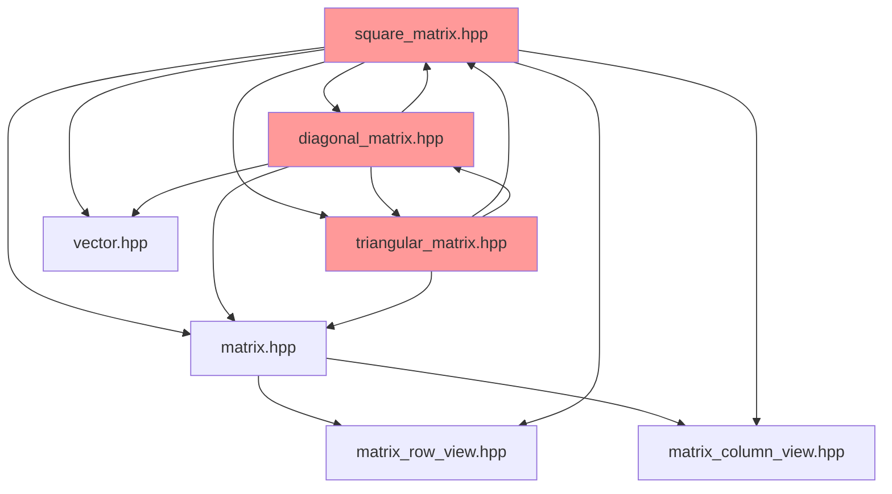
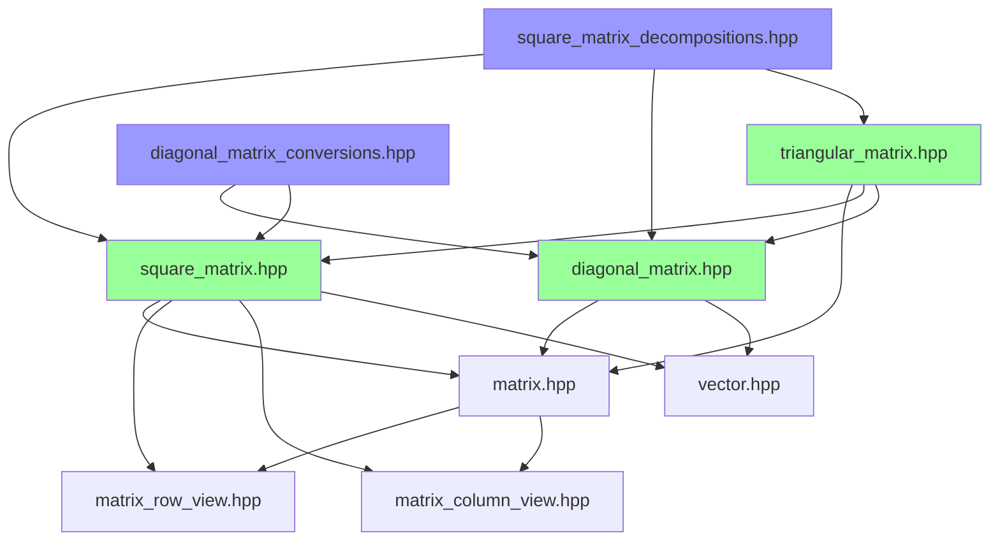

# Cyclic Dependencies Analysis and Resolution Plan

## Overview

This plan analyzes the cyclic include dependencies in trackinglib's matrix library and proposes strategies for breaking these cycles to improve compilation times, code maintainability, and architectural clarity.

## Current Dependency Graph

### Implementation File (.hpp) Dependencies



### Identified Cycles

#### Cycle 1: SquareMatrix ↔ DiagonalMatrix
```
square_matrix.hpp → diagonal_matrix.hpp → square_matrix.hpp
```

#### Cycle 2: SquareMatrix ↔ TriangularMatrix
```
square_matrix.hpp → triangular_matrix.hpp → square_matrix.hpp
```

#### Cycle 3: DiagonalMatrix ↔ TriangularMatrix
```
diagonal_matrix.hpp → triangular_matrix.hpp → diagonal_matrix.hpp
```

#### Three-Way Cycle: SquareMatrix ↔ DiagonalMatrix ↔ TriangularMatrix
```
square_matrix.hpp → diagonal_matrix.hpp → triangular_matrix.hpp → square_matrix.hpp
```

## Detailed Analysis

### 1. SquareMatrix Dependencies

**File**: [`include/trackingLib/math/linalg/square_matrix.hpp`](include/trackingLib/math/linalg/square_matrix.hpp)

**Includes**:
- [`diagonal_matrix.hpp`](include/trackingLib/math/linalg/diagonal_matrix.hpp:6) - Line 6
- [`triangular_matrix.hpp`](include/trackingLib/math/linalg/triangular_matrix.hpp:9) - Line 9
- [`matrix_column_view.hpp`](include/trackingLib/math/linalg/matrix_column_view.hpp:7) - Line 7
- [`matrix_row_view.hpp`](include/trackingLib/math/linalg/matrix_row_view.hpp:8) - Line 8
- [`vector.hpp`](include/trackingLib/math/linalg/vector.hpp:10) - Line 10

**Why DiagonalMatrix is needed**:
1. **Constructor**: [`SquareMatrix(const DiagonalMatrix&)`](include/trackingLib/math/linalg/square_matrix.h:50) - Line 50
2. **Identity()**: Returns `DiagonalMatrix` internally
3. **setIdentity()**: Uses `DiagonalMatrix`
4. **decomposeLDLT()**: Returns `std::pair<TriangularMatrix, DiagonalMatrix>`
5. **decomposeUDUT()**: Returns `std::pair<TriangularMatrix, DiagonalMatrix>`

**Why TriangularMatrix is needed**:
1. **householderQR()**: Returns `std::pair<SquareMatrix, TriangularMatrix>`
2. **decomposeLLT()**: Returns `TriangularMatrix`
3. **decomposeLDLT()**: Returns `std::pair<TriangularMatrix, DiagonalMatrix>`
4. **decomposeUDUT()**: Returns `std::pair<TriangularMatrix, DiagonalMatrix>`

### 2. DiagonalMatrix Dependencies

**File**: [`include/trackingLib/math/linalg/diagonal_matrix.hpp`](include/trackingLib/math/linalg/diagonal_matrix.hpp)

**Includes**:
- [`matrix.hpp`](include/trackingLib/math/linalg/matrix.hpp:6) - Line 6
- [`square_matrix.hpp`](include/trackingLib/math/linalg/square_matrix.hpp:7) - Line 7
- [`triangular_matrix.hpp`](include/trackingLib/math/linalg/triangular_matrix.hpp:8) - Line 8
- [`vector.hpp`](include/trackingLib/math/linalg/vector.hpp:9) - Line 9

**Why SquareMatrix is needed**:
1. **FromMatrix()**: [`static auto FromMatrix(const SquareMatrix&)`](include/trackingLib/math/linalg/diagonal_matrix.h:44) - Line 44
2. **print()**: Converts to `SquareMatrix` for printing

**Why TriangularMatrix is needed**:
1. **operator*(TriangularMatrix)**: [`operator*(const TriangularMatrix&)`](include/trackingLib/math/linalg/diagonal_matrix.h:92) - Line 92

### 3. TriangularMatrix Dependencies

**File**: [`include/trackingLib/math/linalg/triangular_matrix.hpp`](include/trackingLib/math/linalg/triangular_matrix.hpp)

**Includes**:
- [`diagonal_matrix.hpp`](include/trackingLib/math/linalg/diagonal_matrix.hpp:6) - Line 6
- [`matrix.hpp`](include/trackingLib/math/linalg/matrix.hpp:7) - Line 7
- [`square_matrix.hpp`](include/trackingLib/math/linalg/square_matrix.hpp:8) - Line 8

**Why SquareMatrix is needed**:
- **Inheritance**: `TriangularMatrix` inherits from `SquareMatrix`

**Why DiagonalMatrix is needed**:
- **Multiplication helpers**: Internal multiplication operations with diagonal matrices

## Impact Analysis

### Compilation Impact
- **Increased Compile Times**: Each cycle forces recompilation of all involved headers
- **Template Instantiation Overhead**: Circular dependencies multiply template instantiation work
- **Cascading Recompilation**: Changes to any file trigger recompilation of entire cycle

### Maintainability Impact
- **Harder to Understand**: Circular dependencies obscure the logical hierarchy
- **Difficult to Refactor**: Changes require careful coordination across multiple files
- **Testing Complexity**: Mocking and unit testing becomes more difficult

### Header Guard Protection
- **Current State**: Header guards prevent infinite recursion
- **Problem**: Doesn't solve the architectural issue or compilation overhead
- **Risk**: Easy to introduce subtle bugs when modifying

## Resolution Strategies

### Strategy 1: Forward Declarations + Separate Implementation Headers

**Approach**: Use forward declarations in headers, move implementations requiring full types to separate files.

**Example Structure**:
```
square_matrix.h           - Forward declarations only
square_matrix.hpp         - Basic implementations
square_matrix_decomp.hpp  - Decomposition implementations (needs TriangularMatrix, DiagonalMatrix)
```

**Pros**:
- Clean separation of concerns
- Users include only what they need
- Faster compilation for basic operations

**Cons**:
- More files to manage
- Users must know which header to include
- Slightly more complex build

### Strategy 2: Move Factory Methods to Utility Headers

**Approach**: Move cross-type factory methods to separate utility headers.

**Example**:
```cpp
// diagonal_matrix_utils.hpp
namespace tracking::math::utils {
  template <typename ValueType_, sint32 Size_, bool IsRowMajor_>
  auto DiagonalFromSquare(const SquareMatrix<ValueType_, Size_, IsRowMajor_>& mat) 
      -> DiagonalMatrix<ValueType_, Size_>;
}
```

**Affected Methods**:
- `DiagonalMatrix::FromMatrix(SquareMatrix)` → `utils::DiagonalFromSquare()`
- `SquareMatrix(DiagonalMatrix)` → Keep as-is (can use forward declaration)

**Pros**:
- Breaks cycle without major refactoring
- Clear separation of conversion utilities
- Easy to find conversion functions

**Cons**:
- Changes API (breaking change)
- Need to update all existing code
- Utility namespace may feel less natural

### Strategy 3: Refactor print() Methods

**Approach**: Remove or refactor `print()` methods that cause dependencies.

**Current Issue**:
- [`DiagonalMatrix::print()`](include/trackingLib/math/linalg/diagonal_matrix.h:148) converts to `SquareMatrix` for printing

**Solutions**:
1. **Remove print()**: Use `operator<<` instead (see print refactoring plan)
2. **Implement directly**: Print diagonal elements without conversion
3. **Template helper**: Use template function that doesn't require full type

**Pros**:
- Simplifies dependencies
- Better C++ idioms with `operator<<`
- More flexible output options

**Cons**:
- Breaking change if users rely on `print()`
- Need to update existing code

### Strategy 4: Pimpl Idiom for Complex Types

**Approach**: Use pointer-to-implementation for types with complex dependencies.

**Example**:
```cpp
class SquareMatrix {
private:
  struct Impl;
  std::unique_ptr<Impl> pImpl;
};
```

**Pros**:
- Completely breaks compile-time dependencies
- Stable ABI
- Hides implementation details

**Cons**:
- Runtime overhead (heap allocation, indirection)
- Violates AUTOSAR no-dynamic-allocation requirement
- More complex implementation
- **NOT SUITABLE** for this project

### Strategy 5: Type Erasure with std::variant

**Approach**: Use `std::variant` to store different matrix types without full type knowledge.

**Pros**:
- No dynamic allocation
- Type-safe

**Cons**:
- Complex implementation
- Runtime overhead
- Doesn't fit the current design
- **NOT RECOMMENDED**

## Recommended Solution

### Phase 1: Quick Wins (Low Risk)

#### 1.1 Refactor DiagonalMatrix::print()
**Action**: Implement `print()` without converting to `SquareMatrix`

**Implementation**:
```cpp
template <typename ValueType_, sint32 Size_>
void DiagonalMatrix<ValueType_, Size_>::print() const
{
  for (sint32 i = 0; i < Size_; ++i)
  {
    for (sint32 j = 0; j < Size_; ++j)
    {
      if (i == j) {
        std::cout << at_unsafe(i) << ", ";
      } else {
        std::cout << "0, ";
      }
    }
    std::cout << "\n";
  }
  std::cout << "\n" << std::endl;
}
```

**Impact**: Removes one dependency from `diagonal_matrix.hpp` → `square_matrix.hpp`

#### 1.2 Move DiagonalMatrix::FromMatrix() to Utility Header
**Action**: Create `diagonal_matrix_conversions.hpp`

**Files**:
- Create: `include/trackingLib/math/linalg/diagonal_matrix_conversions.hpp`
- Update: `diagonal_matrix.hpp` (remove `FromMatrix`)
- Update: All call sites

**Impact**: Breaks `diagonal_matrix.hpp` → `square_matrix.hpp` dependency

### Phase 2: Decomposition Separation (Medium Risk)

#### 2.1 Create square_matrix_decompositions.hpp
**Action**: Move decomposition methods to separate header

**New File**: `include/trackingLib/math/linalg/square_matrix_decompositions.hpp`

**Methods to Move**:
- `householderQR()`
- `decomposeLLT()`
- `decomposeLDLT()`
- `decomposeUDUT()`

**square_matrix.h Changes**:
```cpp
// Forward declarations only
[[nodiscard]] auto householderQR() const 
    -> std::pair<SquareMatrix, TriangularMatrix<ValueType_, Size_, false, IsRowMajor_>>;
// ... other declarations
```

**square_matrix.hpp Changes**:
- Remove decomposition implementations
- Keep basic methods

**square_matrix_decompositions.hpp**:
```cpp
#include "square_matrix.hpp"
#include "triangular_matrix.hpp"
#include "diagonal_matrix.hpp"

// Implementations of decomposition methods
```

**Usage**:
```cpp
#include "square_matrix.hpp"  // Basic operations
#include "square_matrix_decompositions.hpp"  // Only when needed
```

**Impact**: 
- Breaks `square_matrix.hpp` → `triangular_matrix.hpp` dependency
- Breaks `square_matrix.hpp` → `diagonal_matrix.hpp` dependency (partially)
- Users must include decompositions header when needed

### Phase 3: Constructor Handling (Low Risk)

#### 3.1 SquareMatrix(DiagonalMatrix) Constructor
**Current**: Requires full `DiagonalMatrix` type in `.hpp`

**Solution**: Keep as-is, use forward declaration in `.h`

**Rationale**:
- Constructor implementation needs full type
- This is acceptable - users including `square_matrix.hpp` likely need both types
- Forward declaration in `.h` is sufficient

## Dependency Graph After Refactoring



**Key Improvements**:
- No cycles in core headers
- Optional headers for advanced features
- Clear dependency hierarchy

## Implementation Plan

### Step 1: Refactor DiagonalMatrix::print()
**Effort**: 1 hour
**Risk**: Low
**Files**: `diagonal_matrix.hpp`

**Actions**:
1. Implement `print()` without `SquareMatrix` conversion
2. Test output matches previous behavior
3. Remove `#include "square_matrix.hpp"` from `diagonal_matrix.hpp`

### Step 2: Create diagonal_matrix_conversions.hpp
**Effort**: 2 hours
**Risk**: Medium (API change)
**Files**: New file + updates to call sites

**Actions**:
1. Create new header file
2. Move `FromMatrix()` implementation
3. Update all call sites
4. Update tests
5. Update documentation

### Step 3: Create square_matrix_decompositions.hpp
**Effort**: 3 hours
**Risk**: Medium (file organization change)
**Files**: New file + updates to `square_matrix.hpp`

**Actions**:
1. Create new header file
2. Move decomposition implementations
3. Update `square_matrix.hpp` to keep declarations only
4. Update all files that use decompositions
5. Update tests
6. Update documentation

### Step 4: Verify and Test
**Effort**: 2 hours
**Risk**: Low

**Actions**:
1. Run full test suite
2. Verify no compilation errors
3. Check compilation times (before/after)
4. Update architecture documentation
5. Update memory bank

### Step 5: Documentation
**Effort**: 1 hour
**Risk**: Low

**Actions**:
1. Update [`architecture.md`](.kilocode/rules/memory-bank/architecture.md)
2. Update code comments
3. Add migration guide if API changed
4. Document new include patterns

## Testing Strategy

### Compilation Tests
- Verify all files compile independently
- Check for circular dependency warnings
- Measure compilation time improvements

### Functional Tests
- Run existing test suite
- Verify all tests pass
- Add tests for new utility functions

### Integration Tests
- Test common usage patterns
- Verify backward compatibility where maintained
- Test new include patterns

## Risks and Mitigation

### Risk 1: Breaking Changes
**Mitigation**: 
- Provide migration guide
- Keep old API as deprecated for one release
- Clear documentation of changes

### Risk 2: Compilation Errors
**Mitigation**:
- Incremental changes with testing
- Keep git history clean for easy rollback
- Test on multiple compilers (GCC, Clang)

### Risk 3: Performance Regression
**Mitigation**:
- Benchmark before and after
- Ensure no runtime overhead added
- Verify template instantiation patterns

## Success Criteria

1. **No Circular Dependencies**: Static analysis shows no cycles
2. **All Tests Pass**: Existing test suite passes without modification
3. **Compilation Time**: Measurable improvement in compilation time
4. **Code Quality**: Improved maintainability and clarity
5. **Documentation**: Clear documentation of new structure

## Timeline

- **Phase 1**: 3 hours (Quick wins)
- **Phase 2**: 3 hours (Decomposition separation)
- **Phase 3**: 1 hour (Constructor handling)
- **Testing**: 2 hours
- **Documentation**: 1 hour

**Total**: 10 hours

## Open Questions

1. Should we deprecate old API or make breaking changes immediately?
2. What is the acceptable level of API changes for users?
3. Are there other files that depend on these headers we haven't analyzed?
4. Should we create a migration guide for users?
5. What is the priority: compilation time vs. API stability?

## Next Steps

1. Get stakeholder approval for approach
2. Create feature branch for refactoring
3. Implement Phase 1 (quick wins)
4. Measure impact and decide on Phase 2
5. Complete implementation
6. Update documentation
7. Merge to main branch
