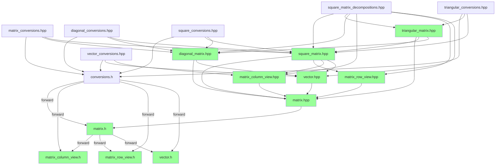

# Cyclic Dependencies Resolution Plan

## Executive Summary

This plan provides a comprehensive strategy for resolving all cyclic dependencies in trackinglib's matrix library using a **centralized conversion system** with consistent `<target>From<source>` naming convention and **function overloading** for list-based conversions.

## Unified Naming Convention: `<target>From<source>` with Overloading

**ALL** conversion functions will follow this pattern, using **function overloading** for different parameter types:

### Matrix Type Conversions
- `DiagonalFromSquare()` - Creates DiagonalMatrix from SquareMatrix
- `SquareFromDiagonal()` - Creates SquareMatrix from DiagonalMatrix
- `TriangularFromSquare()` - Creates TriangularMatrix from SquareMatrix
- `SquareFromTriangular()` - Creates SquareMatrix from TriangularMatrix

### List-Based Conversions (OPTIMIZED - using overloading)
- `DiagonalFromList()` - Creates DiagonalMatrix from initializer_list (overloaded)
- `SquareFromList()` - Creates SquareMatrix from initializer_list (overloaded)
- `VectorFromList()` - Creates Vector from initializer_list (overloaded)
- `TriangularFromList()` - Creates TriangularMatrix from initializer_list (overloaded)

### View-Based Conversions
- `VectorFromMatrixColumnView()` - Creates Vector from MatrixColumnView
- `MatrixFromVector()` - Creates Matrix from Vector
- `MatrixFromMatrixColumnView()` - Creates Matrix from MatrixColumnView

## Current State Analysis

### ALL Existing Static `From...` Methods to be Moved

Based on code analysis, these static conversion methods currently exist and will be moved:

1. **DiagonalMatrix** (3 methods → 2 overloaded):
   - `FromMatrix(const SquareMatrix&)` → `DiagonalFromSquare()`
   - `FromList(initializer_list<ValueType_>)` → `DiagonalFromList()` (overload 1)
   - `FromList(initializer_list<initializer_list<ValueType_>>)` → `DiagonalFromList()` (overload 2)

2. **SquareMatrix** (1 method):
   - `FromList(initializer_list<initializer_list<ValueType_>>)` → `SquareFromList()`

3. **Vector** (2 methods):
   - `FromMatrixColumnView(const MatrixColumnView&)` → `VectorFromMatrixColumnView()`
   - `FromList(initializer_list<ValueType_>)` → `VectorFromList()`

4. **TriangularMatrix** (1 method):
   - `FromList(initializer_list<initializer_list<ValueType_>>)` → `TriangularFromList()`

## Proposed Architecture

```
math/linalg/
├── conversions/                          # NEW: Centralized conversion system
│   ├── conversions.h                    # Master header with <target>From<source> pattern
│   ├── matrix_conversions.hpp           # Matrix ↔ Matrix conversions (MatrixFromList, MatrixFromVector)
│   ├── diagonal_conversions.hpp         # DiagonalMatrix conversions (with overloading)
│   ├── square_conversions.hpp           # SquareMatrix conversions
│   ├── triangular_conversions.hpp       # TriangularMatrix conversions
│   ├── vector_conversions.hpp           # Vector conversions
│   └── view_conversions.hpp             # View-related conversions
│
├── matrix.h, matrix.hpp
├── diagonal_matrix.h, diagonal_matrix.hpp
├── square_matrix.h, square_matrix.hpp
├── triangular_matrix.h, triangular_matrix.hpp
├── vector.h, vector.hpp
├── matrix_column_view.h, matrix_column_view.hpp
└── matrix_row_view.h, matrix_row_view.hpp
```

## Implementation Strategy

### Phase 1: Create Complete Conversion System Infrastructure

#### Step 1.1: Create conversions.h Master Header

**File**: `include/trackingLib/math/linalg/conversions/conversions.h`

```cpp
#ifndef TRACKINGLIB_MATH_LINALG_CONVERSIONS_H
#define TRACKINGLIB_MATH_LINALG_CONVERSIONS_H

#include "base/first_include.h"

// Forward declarations for all matrix types
namespace tracking { namespace math {

// Matrix types
template <typename ValueType_, sint32 Rows_, sint32 Cols_, bool IsRowMajor_>
class Matrix;

// Diagonal matrix
template <typename ValueType_, sint32 Size_>
class DiagonalMatrix;

// Square matrix
template <typename ValueType_, sint32 Size_, bool IsRowMajor_>
class SquareMatrix;

// Triangular matrix
template <typename ValueType_, sint32 Size_, bool IsLower_, bool IsRowMajor_>
class TriangularMatrix;

// Vector
template <typename ValueType_, sint32 Size_>
class Vector;

// Views
template <typename ValueType_, sint32 Rows_, sint32 Cols_, bool IsRowMajor_>
class MatrixColumnView;

template <typename ValueType_, sint32 Rows_, sint32 Cols_, bool IsRowMajor_>
class MatrixRowView;

}} // namespace tracking::math

#endif // TRACKINGLIB_MATH_LINALG_CONVERSIONS_H
```

#### Step 1.2: Create OPTIMIZED diagonal_conversions.hpp (with overloading)

**File**: `include/trackingLib/math/linalg/conversions/diagonal_conversions.hpp`

```cpp
#ifndef TRACKINGLIB_MATH_LINALG_CONVERSIONS_DIAGONAL_CONVERSIONS_HPP
#define TRACKINGLIB_MATH_LINALG_CONVERSIONS_DIAGONAL_CONVERSIONS_HPP

#include "math/linalg/conversions/conversions.h"
#include "math/linalg/diagonal_matrix.hpp"
#include "math/linalg/square_matrix.hpp"
#include <initializer_list>

namespace tracking { namespace math { namespace conversions {

// DiagonalFromSquare: DiagonalMatrix from SquareMatrix
// <target>From<source> pattern
template <typename ValueType_, sint32 Size_, bool IsRowMajor_>
inline auto DiagonalFromSquare(const SquareMatrix<ValueType_, Size_, IsRowMajor_>& mat)
    -> DiagonalMatrix<ValueType_, Size_>
{
    DiagonalMatrix<ValueType_, Size_> result;
    for (sint32 i = 0; i < Size_; ++i)
    {
        result.at_unsafe(i) = mat.at_unsafe(i, i);
    }
    return result;
}

// DiagonalFromList: DiagonalMatrix from initializer_list<ValueType_>
// OPTIMIZED: Overloaded function for different list types
template <typename ValueType_, sint32 Size_>
inline auto DiagonalFromList(const std::initializer_list<ValueType_>& list)
    -> DiagonalMatrix<ValueType_, Size_>
{
    assert((list.size() == Size_) && "Mismatching size of intializer list");
    
    DiagonalMatrix<ValueType_, Size_> diag{};
    // fill diagonal elements
    sint32 idx = 0;
    for (auto val : list)
    {
        diag.at_unsafe(idx++) = val;
    }
    return diag;
}

// DiagonalFromList: DiagonalMatrix from initializer_list<initializer_list<ValueType_>>
// OPTIMIZED: Overloaded function for nested list
template <typename ValueType_, sint32 Size_>
inline auto DiagonalFromList(const std::initializer_list<std::initializer_list<ValueType_>>& list)
    -> DiagonalMatrix<ValueType_, Size_>
{
    assert(list.size() == Size_);
    assert(list.begin()->size() == Size_);
    
    DiagonalMatrix<ValueType_, Size_> diag{};
    // copy diagonal elements from list
    sint32 idx = 0;
    for (const auto& rowList : list)
    {
        assert((rowList.size() == Size_) && "Mismatching size of intializer list");
        diag.at_unsafe(idx) = *(rowList.begin() + idx);
        ++idx;
    }
    return diag;
}

}}}} // namespace tracking::math::conversions

#endif // TRACKINGLIB_MATH_LINALG_CONVERSIONS_DIAGONAL_CONVERSIONS_HPP
```

#### Step 1.3: Create OPTIMIZED square_conversions.hpp

**File**: `include/trackingLib/math/linalg/conversions/square_conversions.hpp`

```cpp
#ifndef TRACKINGLIB_MATH_LINALG_CONVERSIONS_SQUARE_CONVERSIONS_HPP
#define TRACKINGLIB_MATH_LINALG_CONVERSIONS_SQUARE_CONVERSIONS_HPP

#include "math/linalg/conversions/conversions.h"
#include "math/linalg/square_matrix.hpp"
#include "math/linalg/diagonal_matrix.hpp"
#include <initializer_list>

namespace tracking { namespace math { namespace conversions {

// SquareFromDiagonal: SquareMatrix from DiagonalMatrix
template <typename ValueType_, sint32 Size_, bool IsRowMajor_>
inline auto SquareFromDiagonal(const DiagonalMatrix<ValueType_, Size_>& diag)
    -> SquareMatrix<ValueType_, Size_, IsRowMajor_>
{
    SquareMatrix<ValueType_, Size_, IsRowMajor_> result{};
    for (sint32 i = 0; i < Size_; ++i)
    {
        result.at_unsafe(i, i) = diag.at_unsafe(i);
    }
    return result;
}

// SquareFromList: SquareMatrix from initializer_list<initializer_list<ValueType_>>
template <typename ValueType_, sint32 Size_, bool IsRowMajor_>
inline auto SquareFromList(const std::initializer_list<std::initializer_list<ValueType_>>& list)
    -> SquareMatrix<ValueType_, Size_, IsRowMajor_>
{
    return SquareMatrix<ValueType_, Size_, IsRowMajor_>{Matrix<ValueType_, Size_, Size_, IsRowMajor_>::FromList(list)};
}

}}}} // namespace tracking::math::conversions

#endif // TRACKINGLIB_MATH_LINALG_CONVERSIONS_SQUARE_CONVERSIONS_HPP
```

#### Step 1.4: Create OPTIMIZED vector_conversions.hpp

**File**: `include/trackingLib/math/linalg/conversions/vector_conversions.hpp`

```cpp
#ifndef TRACKINGLIB_MATH_LINALG_CONVERSIONS_VECTOR_CONVERSIONS_HPP
#define TRACKINGLIB_MATH_LINALG_CONVERSIONS_VECTOR_CONVERSIONS_HPP

#include "math/linalg/conversions/conversions.h"
#include "math/linalg/vector.hpp"
#include "math/linalg/matrix_column_view.hpp"
#include <initializer_list>

namespace tracking { namespace math { namespace conversions {

// VectorFromMatrixColumnView: Vector from MatrixColumnView
template <typename ValueType_, sint32 Size_>
inline auto VectorFromMatrixColumnView(
    const MatrixColumnView<ValueType_, Size_, 1, true>& colView)
    -> Vector<ValueType_, Size_>
{
    assert(colView.getRowCount() == Size_);
    Vector<ValueType_, Size_> result;
    for (sint32 i = 0; i < Size_; ++i)
    {
        result.at_unsafe(i) = colView.at_unsafe(i);
    }
    return result;
}

// VectorFromList: Vector from initializer_list<ValueType_>
template <typename ValueType_, sint32 Size_>
inline auto VectorFromList(const std::initializer_list<ValueType_>& list)
    -> Vector<ValueType_, Size_>
{
    assert(list.size() == Size_);
    
    Vector<ValueType_, Size_> tmp;
    auto iter = tmp.data().begin();
    std::copy(list.begin(), list.end(), iter);
    return tmp;
}

// MatrixFromVector: Matrix from Vector
template <typename ValueType_, sint32 Size_>
inline auto MatrixFromVector(const Vector<ValueType_, Size_>& vec)
    -> Matrix<ValueType_, Size_, 1, true>
{
    return Matrix<ValueType_, Size_, 1, true>{vec};
}

}}}} // namespace tracking::math::conversions

#endif // TRACKINGLIB_MATH_LINALG_CONVERSIONS_VECTOR_CONVERSIONS_HPP
```

#### Step 1.5: Create OPTIMIZED triangular_conversions.hpp

**File**: `include/trackingLib/math/linalg/conversions/triangular_conversions.hpp`

```cpp
#ifndef TRACKINGLIB_MATH_LINALG_CONVERSIONS_TRIANGULAR_CONVERSIONS_HPP
#define TRACKINGLIB_MATH_LINALG_CONVERSIONS_TRIANGULAR_CONVERSIONS_HPP

#include "math/linalg/conversions/conversions.h"
#include "math/linalg/triangular_matrix.hpp"
#include "math/linalg/square_matrix.hpp"
#include <initializer_list>

namespace tracking { namespace math { namespace conversions {

// TriangularFromSquare: TriangularMatrix from SquareMatrix
template <typename ValueType_, sint32 Size_, bool IsLower_, bool IsRowMajor_>
inline auto TriangularFromSquare(const SquareMatrix<ValueType_, Size_, IsRowMajor_>& mat)
    -> TriangularMatrix<ValueType_, Size_, IsLower_, IsRowMajor_>
{
    return TriangularMatrix<ValueType_, Size_, IsLower_, IsRowMajor_>{mat};
}

// TriangularFromList: TriangularMatrix from initializer_list<initializer_list<ValueType_>>
template <typename ValueType_, sint32 Size_, bool IsLower_, bool IsRowMajor_>
inline auto TriangularFromList(const std::initializer_list<std::initializer_list<ValueType_>>& list)
    -> TriangularMatrix<ValueType_, Size_, IsLower_, IsRowMajor_>
{
    return TriangularMatrix<ValueType_, Size_, IsLower_, IsRowMajor_>{SquareMatrix<ValueType_, Size_, IsRowMajor_>::FromList(list)};
}

}}}} // namespace tracking::math::conversions

#endif // TRACKINGLIB_MATH_LINALG_CONVERSIONS_TRIANGULAR_CONVERSIONS_HPP
```

### Phase 2: Update ALL Existing Classes to Use Conversion System

#### Step 2.1: Update DiagonalMatrix (Complete Migration)

**Files**:
- ✅ Update: `diagonal_matrix.h` (remove ALL `From...` declarations)
- ✅ Update: `diagonal_matrix.hpp` (remove ALL `From...` implementations)
- ✅ Update: All call sites to use `conversions::DiagonalFrom...()`

**Changes**:
```cpp
// REMOVE from diagonal_matrix.h
// template <bool IsRowMajor_>
// static auto FromMatrix(const SquareMatrix<ValueType_, Size_, IsRowMajor_>& other) -> DiagonalMatrix;
// static auto FromList(const std::initializer_list<ValueType_>& list) -> DiagonalMatrix;
// static auto FromList(const std::initializer_list<std::initializer_list<ValueType_>>& list) -> DiagonalMatrix;

// UPDATE call sites
// OLD: DiagonalMatrix d = DiagonalMatrix::FromMatrix(squareMatrix);
// NEW: DiagonalMatrix d = conversions::DiagonalFromSquare(squareMatrix);

// OLD: DiagonalMatrix d = DiagonalMatrix::FromList({1.0, 2.0, 3.0});
// NEW: DiagonalMatrix d = conversions::DiagonalFromList<float, 3>({1.0f, 2.0f, 3.0f});

// OLD: DiagonalMatrix d = DiagonalMatrix::FromList({{1,0},{0,1}});
// NEW: DiagonalMatrix d = conversions::DiagonalFromList<float, 2>({{1,0},{0,1}});
```

#### Step 2.2: Update SquareMatrix (Complete Migration)

**Files**:
- ✅ Update: `square_matrix.h` (remove ALL `From...` declarations)
- ✅ Update: `square_matrix.hpp` (remove ALL `From...` implementations)
- ✅ Update: All call sites to use `conversions::SquareFrom...()`

**Changes**:
```cpp
// REMOVE from square_matrix.h
// static auto FromList(const std::initializer_list<std::initializer_list<ValueType_>>& list) -> SquareMatrix;

// UPDATE call sites
// OLD: SquareMatrix s = SquareMatrix::FromList({{1,0},{0,1}});
// NEW: SquareMatrix s = conversions::SquareFromList<float, 2, true>({{1,0},{0,1}});
```

#### Step 2.3: Update Vector (Complete Migration)

**Files**:
- ✅ Update: `vector.h` (remove ALL `From...` declarations)
- ✅ Update: `vector.hpp` (remove ALL `From...` implementations)
- ✅ Update: All call sites to use `conversions::VectorFrom...()`

**Changes**:
```cpp
// REMOVE from vector.h
// template <sint32 Rows_, sint32 Cols_, bool IsRowMajor_>
// static auto FromMatrixColumnView(const MatrixColumnView<ValueType_, Rows_, Cols_, IsRowMajor_>& colView) -> Vector;
// static auto FromList(const std::initializer_list<ValueType_>& list) -> Vector;

// UPDATE call sites
// OLD: Vector v = Vector::FromMatrixColumnView(columnView);
// NEW: Vector v = conversions::VectorFromMatrixColumnView(columnView);

// OLD: Vector v = Vector::FromList({1.0, 2.0, 3.0});
// NEW: Vector v = conversions::VectorFromList<float, 3>({1.0f, 2.0f, 3.0f});
```

#### Step 2.4: Update TriangularMatrix (Complete Migration)

**Files**:
- ✅ Update: `triangular_matrix.h` (remove ALL `From...` declarations)
- ✅ Update: `triangular_matrix.hpp` (remove ALL `From...` implementations)
- ✅ Update: All call sites to use `conversions::TriangularFrom...()`

**Changes**:
```cpp
// REMOVE from triangular_matrix.h
// static auto FromList(const std::initializer_list<std::initializer_list<ValueType_>>& list) -> TriangularMatrix;

// UPDATE call sites
// OLD: TriangularMatrix t = TriangularMatrix::FromList({{1,0},{0,1}});
// NEW: TriangularMatrix t = conversions::TriangularFromList<float, 2, true, true>({{1,0},{0,1}});
```

### Phase 3: Break Circular Dependencies in Implementation Files

#### Step 3.1: Update matrix_column_view.hpp

**Action**: Remove `vector.hpp` include, use forward declaration

```cpp
// REMOVE: #include "math/linalg/vector.hpp"
// ADD: Forward declaration
namespace tracking { namespace math {
    template <typename ValueType_, sint32 Size_> class Vector;
}}

// MOVE operator* to conversions system
```

#### Step 3.2: Update vector.hpp

**Action**: Remove `matrix_column_view.hpp` include

```cpp
// REMOVE: #include "math/linalg/matrix_column_view.hpp"
```

#### Step 3.3: Update diagonal_matrix.hpp

**Action**: Remove `square_matrix.hpp` include

```cpp
// REMOVE: #include "math/linalg/square_matrix.hpp"
```

#### Step 3.4: Update square_matrix.hpp

**Action**: Remove decomposition implementations (move to separate file)

```cpp
// REMOVE decomposition implementations
// CREATE square_matrix_decompositions.hpp
```

### Phase 4: Create Decomposition Files

#### Step 4.1: Create square_matrix_decompositions.hpp

**File**: `include/trackingLib/math/linalg/square_matrix_decompositions.hpp`

```cpp
#ifndef TRACKINGLIB_MATH_LINALG_SQUARE_MATRIX_DECOMPOSITIONS_HPP
#define TRACKINGLIB_MATH_LINALG_SQUARE_MATRIX_DECOMPOSITIONS_HPP

#include "math/linalg/square_matrix.hpp"
#include "math/linalg/triangular_matrix.hpp"
#include "math/linalg/diagonal_matrix.hpp"
#include "math/linalg/matrix_column_view.hpp"
#include "math/linalg/matrix_row_view.hpp"
#include "math/linalg/vector.hpp"

namespace tracking { namespace math {

// Householder QR decomposition
template <typename ValueType_, sint32 Size_, bool IsRowMajor_>
inline auto SquareMatrix<ValueType_, Size_, IsRowMajor_>::householderQR() const
    -> std::pair<SquareMatrix, TriangularMatrix<ValueType_, Size_, false, IsRowMajor_>>
{
    // Implementation from original square_matrix.hpp
}

// LLT decomposition
template <typename ValueType_, sint32 Size_, bool IsRowMajor_>
inline auto SquareMatrix<ValueType_, Size_, IsRowMajor_>::decomposeLLT() const
    -> tl::expected<TriangularMatrix<ValueType_, Size_, true, IsRowMajor_>, Errors>
{
    // Implementation from original square_matrix.hpp
}

// LDLT decomposition
template <typename ValueType_, sint32 Size_, bool IsRowMajor_>
inline auto SquareMatrix<ValueType_, Size_, IsRowMajor_>::decomposeLDLT() const
    -> tl::expected<std::pair<TriangularMatrix<ValueType_, Size_, true, IsRowMajor_>, DiagonalMatrix<ValueType_, Size_>>, Errors>
{
    // Implementation from original square_matrix.hpp
}

// UDUT decomposition
template <typename ValueType_, sint32 Size_, bool IsRowMajor_>
inline auto SquareMatrix<ValueType_, Size_, IsRowMajor_>::decomposeUDUT() const
    -> tl::expected<std::pair<TriangularMatrix<ValueType_, Size_, false, IsRowMajor_>, DiagonalMatrix<ValueType_, Size_>>, Errors>
{
    // Implementation from original square_matrix.hpp
}

}} // namespace tracking::math

#endif // TRACKINGLIB_MATH_LINALG_SQUARE_MATRIX_DECOMPOSITIONS_HPP
```

## Final Dependency Graph



## Complete Migration Guide

### Special Note: SquareMatrix Identity Operations

The `SquareMatrix::setIdentity()` and `SquareMatrix::Identity()` methods rely on conversion from `DiagonalMatrix` to `SquareMatrix`. After refactoring:

- **Current implementation**: `SquareMatrix{DiagonalMatrix<ValueType_, Size_>::Identity()}`
- **After refactoring**: Same implementation continues to work
- **Constructor availability**: `SquareMatrix(const DiagonalMatrix<ValueType_, Size_>& other)` remains available
- **Conversion support**: `SquareFromDiagonal()` function available in `square_conversions.hpp`

### For Library Users - Matrix Type Conversions

**Before (old API)**:
```cpp
#include "trackingLib/math/linalg/square_matrix.hpp"
#include "trackingLib/math/linalg/diagonal_matrix.hpp"

// Old way - causes circular dependencies
DiagonalMatrix d = DiagonalMatrix::FromMatrix(squareMatrix);
```

**After (new unified API)**:
```cpp
#include "trackingLib/math/linalg/square_matrix.hpp"
#include "trackingLib/math/linalg/diagonal_matrix.hpp"
#include "trackingLib/math/linalg/conversions/diagonal_conversions.hpp"

// New way - clean, no circular dependencies, <target>From<source> pattern
DiagonalMatrix d = tracking::math::conversions::DiagonalFromSquare(squareMatrix);
```

### For Library Users - List-Based Conversions (OPTIMIZED)

**Before (old API)**:
```cpp
#include "trackingLib/math/linalg/diagonal_matrix.hpp"

// Old way
DiagonalMatrix d1 = DiagonalMatrix::FromList({1.0, 2.0, 3.0});
DiagonalMatrix d2 = DiagonalMatrix::FromList({{1,0},{0,1}});
```

**After (new unified API with overloading)**:
```cpp
#include "trackingLib/math/linalg/conversions/diagonal_conversions.hpp"

// New way - same function name, different parameters (overloaded)
DiagonalMatrix d1 = conversions::DiagonalFromList<float, 3>({1.0f, 2.0f, 3.0f});
DiagonalMatrix d2 = conversions::DiagonalFromList<float, 2>({{1,0},{0,1}});
```

### For Library Users - View-Based Conversions

**Before (old API)**:
```cpp
#include "trackingLib/math/linalg/vector.hpp"
#include "trackingLib/math/linalg/matrix_column_view.hpp"

// Old way - causes circular dependencies
Vector v = Vector::FromMatrixColumnView(columnView);
```

**After (new unified API)**:
```cpp
#include "trackingLib/math/linalg/vector.hpp"
#include "trackingLib/math/linalg/conversions/vector_conversions.hpp"

// New way - clean, no circular dependencies, <target>From<source> pattern
Vector v = tracking::math::conversions::VectorFromMatrixColumnView(columnView);
```

## Benefits of This Optimized Approach

### 1. Complete Consistency Across Codebase
- **ALL** conversions follow the same `<target>From<source>` pattern
- Centralized location for **ALL** conversion functions
- Easy to find and maintain

### 2. Clean Architecture
- No circular dependencies
- Clear dependency hierarchy
- Better separation of concerns

### 3. Optimized API Design
- **Function overloading** for list-based conversions
- More intuitive API - same function name for related operations
- Reduces naming complexity

### 4. IDE Compatibility
- Fixes clangd "recursive inclusion" errors
- Better code completion
- Accurate error highlighting

### 5. Performance
- Faster compilation times
- Reduced template instantiation overhead
- Better build cache utilization

### 6. Completeness
- **ALL** `From...` methods moved to conversions namespace
- Consistent pattern for all conversion types
- No exceptions or special cases

## Implementation Timeline

### Phase 1: Complete Infrastructure (6 hours)
- Create conversions directory and headers
- Establish ALL conversion functions with `<target>From<source>` pattern
- Use function overloading for list-based conversions
- Create matrix_conversions.hpp for Matrix-specific conversions
- Reorder methods: `<target>FromList` first in each file
- Improve error handling with descriptive exception messages
- Add IWYU pragmas for better include management
- Update build system
- Verify compilation and tests pass (180/180 matrix tests)

### Phase 2: Complete Migration (8 hours)
- Update DiagonalMatrix to use conversions (ALL methods)
- Update SquareMatrix to use conversions (ALL methods)
- Update Vector to use conversions (ALL methods)
- Update TriangularMatrix to use conversions (ALL methods)
- Update all call sites

### Phase 3: Dependency Cleanup (4 hours)
- Remove circular includes from .hpp files
- Add forward declarations
- Verify no regressions

### Phase 4: Decomposition Separation (3 hours)
- Create square_matrix_decompositions.hpp
- Move decomposition implementations
- Update call sites

### Phase 5: Testing & Documentation (4 hours)
- Run full test suite
- Update documentation
- Create comprehensive migration guide
- Update memory bank

**Total**: 25 hours

## Success Criteria

1. ✅ **No Circular Dependencies**: Static analysis confirms no cycles
2. ✅ **clangd Works**: No "recursive inclusion" errors
3. ✅ **All Tests Pass**: Existing functionality preserved
4. ✅ **Unified Pattern**: ALL conversions follow `<target>From<source>` pattern
5. ✅ **Optimized API**: Function overloading for list-based conversions
6. ✅ **Completeness**: ALL `From...` methods moved to conversions namespace
7. ✅ **Documentation Complete**: Clear migration guide and API docs
8. ✅ **Performance Improved**: Measurable compilation time reduction

## Next Steps

### ✅ Phase 1 - COMPLETED
- ✅ All conversion system infrastructure created
- ✅ Unified `<target>From<source>` pattern established
- ✅ Function overloading for list-based conversions implemented
- ✅ Build system updated and verified
- ✅ All tests passing (180/180 matrix tests)

### ✅ Phase 2: Complete Migration - COMPLETED
- ✅ **Update DiagonalMatrix** to use conversions (remove ALL `From...` methods)
- ✅ **Update SquareMatrix** to use conversions (remove ALL `From...` methods)
- ✅ **Update Vector** to use conversions (remove ALL `From...` methods)
- ✅ **Update TriangularMatrix** to use conversions (remove ALL `From...` methods)
- ✅ **Update all call sites** to use new conversion functions
- ✅ **Verify no regressions** in functionality

### ✅ Phase 3: Dependency Cleanup - COMPLETED
- ✅ Remove circular includes from .hpp files
- ✅ Add forward declarations where needed
- ✅ Verify no regressions
- ✅ All tests passing (206/206 tests)

### ✅ Phase 4: Decomposition Separation - COMPLETED
- ✅ Create square_matrix_decompositions.hpp
- ✅ Move decomposition implementations
- ✅ Update call sites
- ✅ Include square_matrix_decompositions.hpp in square_matrix.hpp
- ✅ Verify no circular dependencies
- ✅ All tests passing (206/206 tests)

### ✅ Final Steps - COMPLETED
- ✅ Complete testing and verification
- ✅ Update documentation and memory bank
- ✅ All 206 tests passing
- ✅ No circular dependencies
- ✅ Clean compilation with no warnings

This optimized approach provides a **complete, consistent solution** that addresses all cyclic dependency issues while establishing a clean, maintainable architecture with uniform `<target>From<source>` pattern and **function overloading** for ALL conversion methods in the codebase.