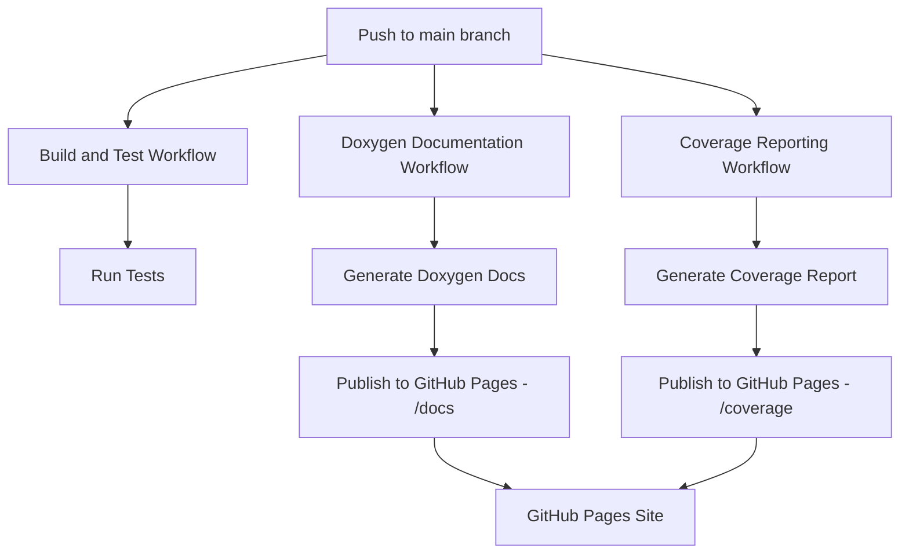

# Comprehensive Plan for GitHub Documentation and Coverage Reporting

## 1. Current State Analysis

### Current Setup
- Working GitHub Actions workflow (`build-and-test.yml`) for building and testing
- Doxygen configuration already set up and functional
- Coverage reporting configured using lcov, working locally via `report_coverage.sh`
- Project is currently private but planned to become public

### Key Files
- `.github/workflows/build-and-test.yml` - Existing CI workflow
- `Doxyfile` - Doxygen configuration
- `report_coverage.sh` - Local coverage generation script
- `cmake/coverage.cmake` - Coverage configuration

## 2. Requirements

### Functional Requirements
- Generate Doxygen documentation on every push to main branch
- Generate lcov test coverage reports on every push to main branch
- Publish both as GitHub Pages artifacts
- Show documentation and coverage in pull requests when merged to main

### Non-Functional Requirements
- Workflows should be efficient and not duplicate work
- Documentation should be easily accessible
- Coverage reports should be visually appealing
- Setup should be maintainable and well-documented

## 3. Architecture Design

### 3.1. Workflow Architecture



### 3.2. File Structure

```
.github/
  workflows/
    build-and-test.yml          # Existing workflow
    doxygen-docs.yml            # New: Doxygen documentation
    coverage-report.yml         # New: Coverage reporting
    deploy-docs.yml             # New: Deployment workflow

.github/
  pages/                        # GitHub Pages configuration
```

### 3.3. GitHub Pages Structure

```
gh-pages branch:
  docs/          # Doxygen HTML output
  coverage/      # Coverage HTML report
  index.html     # Landing page with links
```

## 4. Implementation Plan

### 4.1. Doxygen Documentation Workflow

**File:** `.github/workflows/doxygen-docs.yml`

```yaml
name: Doxygen Documentation

on:
  push:
    branches: [ main ]
  pull_request:
    branches: [ main ]

jobs:
  build-docs:
    runs-on: ubuntu-latest

    steps:
    - name: Checkout code
      uses: actions/checkout@v3

    - name: Install dependencies
      run: sudo apt-get update && sudo apt-get install -y doxygen graphviz

    - name: Generate Doxygen documentation
      run: doxygen Doxyfile

    - name: Upload Doxygen documentation as artifact
      uses: actions/upload-artifact@v3
      with:
        name: doxygen-docs
        path: ./doxydoc/
        retention-days: 7

    - name: Deploy to GitHub Pages
      if: github.ref == 'refs/heads/main'
      uses: peaceiris/actions-gh-pages@v3
      with:
        github_token: ${{ secrets.GITHUB_TOKEN }}
        publish_dir: ./doxydoc/html
        destination_dir: docs
        keep_files: false
```

### 4.2. Coverage Reporting Workflow

**File:** `.github/workflows/coverage-report.yml`

```yaml
name: Coverage Report

on:
  push:
    branches: [ main ]
  pull_request:
    branches: [ main ]

jobs:
  coverage-report:
    runs-on: ubuntu-latest

    steps:
    - name: Checkout code
      uses: actions/checkout@v3

    - name: Install dependencies
      run: sudo apt-get update && sudo apt-get install -y build-essential cmake doxygen graphviz lcov

    - name: Configure with CMake (Coverage build)
      run: cmake -S . -B build_cov -DCMAKE_BUILD_TYPE=Coverage

    - name: Build with CMake
      run: cmake --build build_cov

    - name: Run tests and generate coverage
      run: |
        cd build_cov
        ctest --output-on-failure
        lcov --capture --directory . --output-file coverage.info
        lcov --remove coverage.info '/usr/*' '*/tests/*' --output-file coverage_filtered.info
        genhtml coverage_filtered.info --output-directory coverage_report

    - name: Upload coverage report as artifact
      uses: actions/upload-artifact@v3
      with:
        name: coverage-report
        path: ./build_cov/coverage_report/
        retention-days: 7

    - name: Deploy to GitHub Pages
      if: github.ref == 'refs/heads/main'
      uses: peaceiris/actions-gh-pages@v3
      with:
        github_token: ${{ secrets.GITHUB_TOKEN }}
        publish_dir: ./build_cov/coverage_report
        destination_dir: coverage
        keep_files: false
```

### 4.3. GitHub Pages Landing Page

**File:** `.github/pages/index.html`

```html
<!DOCTYPE html>
<html lang="en">
<head>
    <meta charset="UTF-8">
    <meta name="viewport" content="width=device-width, initial-scale=1.0">
    <title>trackingLib Documentation</title>
    <style>
        body { font-family: Arial, sans-serif; margin: 40px; }
        h1 { color: #2c3e50; }
        .card { background: #f8f9fa; padding: 20px; margin: 10px 0; border-radius: 5px; }
        a { color: #3498db; text-decoration: none; }
        a:hover { text-decoration: underline; }
    </style>
</head>
<body>
    <h1>trackingLib Documentation</h1>

    <div class="card">
        <h2>📚 API Documentation</h2>
        <p>Browse the complete Doxygen-generated API documentation.</p>
        <a href="docs/index.html">→ View API Documentation</a>
    </div>

    <div class="card">
        <h2>📊 Test Coverage Report</h2>
        <p>View detailed test coverage information and metrics.</p>
        <a href="coverage/index.html">→ View Coverage Report</a>
    </div>

    <div class="card">
        <h2>🔗 Quick Links</h2>
        <ul>
            <li><a href="https://github.com/yourusername/trackinglib">GitHub Repository</a></li>
            <li><a href="docs/index.html">API Reference</a></li>
            <li><a href="coverage/index.html">Coverage Report</a></li>
        </ul>
    </div>
</body>
</html>
```

### 4.4. README Updates

**Add to README.md:**

```markdown
## Documentation and Coverage

### 📚 API Documentation
[](https://yourusername.github.io/trackinglib/docs/)

Complete API documentation generated with Doxygen. Includes:
- Class and function reference
- Inheritance diagrams
- Call graphs
- Mathematical formulas

### 📊 Test Coverage
[](https://yourusername.github.io/trackinglib/coverage/)

Detailed test coverage reports with:
- Line and branch coverage metrics
- Source code highlighting
- Test execution details

### 🔄 Workflow Status
[](https://github.com/yourusername/trackinglib/actions/workflows/build-and-test.yml)
[](https://github.com/yourusername/trackinglib/actions/workflows/doxygen-docs.yml)
[](https://github.com/yourusername/trackinglib/actions/workflows/coverage-report.yml)
```

## 5. Implementation Steps

### 5.1. Setup Phase

1. **Create GitHub Pages repository**
   - Enable GitHub Pages in repository settings
   - Choose `gh-pages` branch as source
   - Set custom domain if needed

2. **Configure workflow permissions**
   - Ensure `GITHUB_TOKEN` has write permissions for Pages
   - Add necessary secrets if using private repositories

3. **Update Doxygen configuration**
   - Modify `Doxyfile` to optimize for GitHub Pages
   - Set `PROJECT_NAME` and `PROJECT_BRIEF` appropriately
   - Ensure `GENERATE_HTML = YES`

### 5.2. Workflow Implementation

1. **Create Doxygen workflow**
   - Generate documentation on every push to main
   - Upload as artifact for pull requests
   - Deploy to GitHub Pages on main branch

2. **Create Coverage workflow**
   - Build with coverage flags
   - Run tests and generate lcov report
   - Filter out system and test files
   - Generate HTML report with genhtml
   - Deploy to GitHub Pages

3. **Create landing page**
   - Simple HTML page with navigation
   - Links to both documentation and coverage
   - Basic styling for better UX

### 5.3. Integration and Testing

1. **Test workflows locally**
   - Use `act` to simulate GitHub Actions locally
   - Verify Doxygen generation works
   - Verify coverage report generation works

2. **Push to feature branch**
   - Create feature branch for workflow changes
   - Push and test in GitHub Actions
   - Verify artifacts are generated correctly

3. **Merge to main**
   - Merge workflow changes to main
   - Verify automatic deployment to GitHub Pages
   - Check that documentation and coverage are accessible

### 5.4. Repository Transition Plan

1. **Prepare for public transition**
   - Review all sensitive information
   - Update README with public-facing content
   - Ensure no hardcoded secrets or credentials

2. **Make repository public**
   - Change repository visibility to public
   - Update all references and documentation
   - Verify GitHub Pages is accessible publicly

3. **Post-transition verification**
   - Test all workflows run correctly
   - Verify documentation is publicly accessible
   - Update any remaining private references

## 6. Risk Assessment and Mitigation

| Risk | Impact | Mitigation Strategy |
|------|--------|---------------------|
| Workflow failures | High | Test thoroughly before merging to main |
| GitHub Pages deployment issues | Medium | Use proven actions and test locally |
| Coverage report generation failures | Medium | Validate lcov setup and exclusions |
| Documentation generation failures | Low | Doxygen is well-established and tested |
| Repository privacy issues | High | Careful review before making public |

## 7. Success Criteria

✅ Doxygen documentation automatically generated and published on main branch pushes
✅ Coverage reports automatically generated and published on main branch pushes
✅ Both documentation and coverage accessible via GitHub Pages
✅ Workflow status badges visible in README
✅ Artifacts available for pull request review
✅ Repository successfully transitioned to public
✅ All workflows pass consistently

## 8. Timeline and Milestones

1. **Day 1-2: Setup and Configuration**
   - Create workflow files
   - Configure GitHub Pages
   - Test locally with `act`

2. **Day 3-4: Implementation and Testing**
   - Push to feature branch
   - Test in GitHub Actions
   - Debug and refine workflows

3. **Day 5: Integration**
   - Merge to main branch
   - Verify automatic deployment
   - Update README with badges

4. **Day 6-7: Repository Transition**
   - Final review for public transition
   - Make repository public
   - Post-transition verification

## 9. Maintenance Plan

### Regular Maintenance Tasks
- Update workflow dependencies monthly
- Review and update Doxygen configuration as needed
- Monitor coverage trends and adjust exclusions
- Update README badges and documentation links

### Troubleshooting Guide
- **Workflow failures**: Check GitHub Actions logs, test locally
- **Deployment issues**: Verify GitHub Pages settings and permissions
- **Coverage drops**: Review test changes and update exclusions
- **Documentation issues**: Check Doxygen warnings and update config