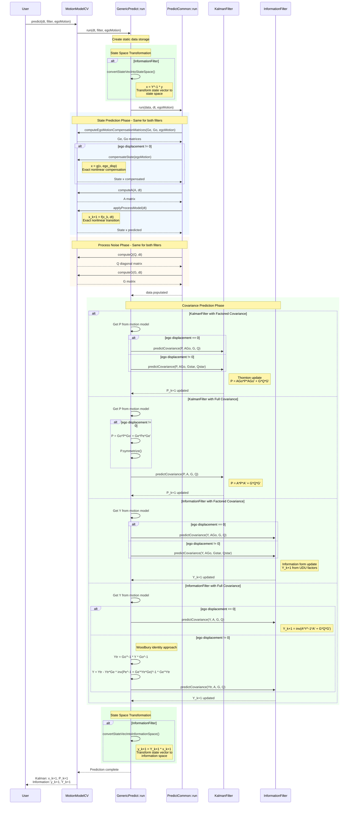

# Filter Prediction Flow for Kalman and Information Filter

## Overview

This document shows the complete prediction flow for both Kalman Filter and Information Filter, highlighting the differences in state representation and covariance handling.

## Prediction Flow Diagram



## Key Differences Between Filters

| Aspect | Kalman Filter | Information Filter |
|--------|---------------|-------------------|
| **State Vector** | x (state) | y = Y * x (information vector) |
| **Covariance** | P (covariance) | Y = P^-1 (information matrix) |
| **Pre-Processing** | None | `convertStateVecIntoStateSpace()` |
| **Post-Processing** | None | `convertStateVecIntoInformationSpace()` |
| **Covariance Update** | P = A*P*A' + G*Q*G' | Y = inv(A*Y^-1*A' + G*Q*G') |

## State Representation

### Kalman Filter
- State vector: `x` in state space
- Covariance: `P` (covariance matrix)
- No transformation needed

### Information Filter
- State vector: `y = Y * x` (information vector)
- Covariance: `Y = P^-1` (information matrix)
- Requires transformation before/after state prediction

## Mathematical Formulation

### State Prediction (Same for both filters)
```
x_compensated = g(x, egoMotion)     // Nonlinear ego motion compensation
x_k+1 = f(x_compensated, dt)        // Nonlinear state transition
```

### Covariance Prediction

**Kalman Filter:**
```
P_k+1 = A * P_k * A' + G * Q * G'
```

**Information Filter:**
```
Y_k+1 = inv(A * Y_k^-1 * A' + G * Q * G')
```

Using Woodbury identity for numerical stability:
```
Y_k+1 = Y_k - Y_k * A' * inv(A * Y_k^-1 * A' + G*Q*G') * A * Y_k
```
